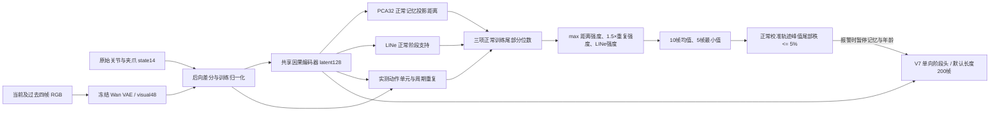

# 模型架构、数据流和报警含义

## 发布模型的组成



## 1. 输入与共享编码器

在线每步将 state 转为 `L6,R6,gL,gR`。首帧后向差分为零；以后 `Δq_t=q_t-q_(t-1)`，没有除以 dt。将 `[q14,Δq14,visual48]` 组成 76 维，使用正常训练帧的逐维 mean/scale 标准化并裁剪到 [-15,15]。

状态和变化分别经过 Linear→GELU→LayerNorm，维度为128，相加形成 motion/state 表示。该表示提供 query，visual48 直接投影为 key/value；4 个 attention head 只看当前及过去119帧。门控融合同时保留当前视觉支路。随后经过四层残差因果 TCN（kernel=3、dilation=1/2/4/8），最后 Linear→ReLU 得到非负 latent128。准确训练左上下文为149帧，在线通过 KV 与卷积缓存等价实现。

训练监督来自离线教师的五阶段 soft masks，加视觉和状态重建：`KL_teacher + 0.5*visual_SmoothL1 + 0.1*state_SmoothL1`。编码器在正常训练集完整遍历2000轮，最后固定；不是在线到来一帧就梯度更新。原始 `protocol` 保存在检查点及 `provenance/encoder_training_protocol.json`。

## 2. 三个 OOD 原始证据

### 正常投影距离 D

latent 先使用正常训练 latent 的 mean/std 标准化并裁剪。对正常训练采样特征拟合不白化 PCA32；每条正常训练轨迹抽8个时刻，总计17968个记忆点。当前投影到最近记忆点的欧氏距离除以 √32，得到 RMS 距离。

经验参考分布每条训练轨迹最多均匀抽128帧，总计287488个采样。计算这些训练查询点的最近距离时排除该 episode 的所有记忆点，避免把自己的距离当成零。推理时查询全部正常库；库不会吸收未知输入。该距离量化 state、motion、visual 的融合特征偏离，并非原始关节距离。

### 动作重复 R

左右臂分别使用6关节+夹爪的正常化实测状态。夹爪经3帧平滑与正常训练分布估计的开/闭迟滞门限，形成 close→open→close 单元，允许6–300帧。单元按关节路径弧长重采样为24个7维点，保留绝对姿态和动作顺序，因此动作速度变化不会直接破坏匹配。

当前单元与最多16个、900帧内的历史单元比较，结合路径 RMS 距离和 visual48 端点差异。相似项形式为 `exp(-2*d_path) * exp(-0.5*d_visual²)`。历史贡献按结束时刻距离以90帧时间常数衰减；没有新单元时也随时间衰减。取左右臂较强者，同时保留夹爪不切换时的固定时间窗周期重复证据。

动作单元证据和周期证据先分别转换为正常尾部强度后取最大，再在正常训练上重新拟合为**一个**重复分布。最终 R 仍是三项之一，没有增加第四个报警判据。不能单凭重复判断任务失败：正常整理衣服也可能重复，因此要用正常分布校准。

### LINe 正常阶段支持不足 L

复用正常五阶段线性分类器，用正常训练数据确定类别相关的神经元重要性和权重掩码。当前 latent 做训练 P99 截断，并按重要性保留约一半特征/连接，使用确定的类别路由后重新计算 logits。分数是负 log-sum-exp 能量；正常类别总体支持越弱，能量越高。

V11 对最高 logits 在 `1e-5` 数值容差内并列的路由选择最低类别编号，防止 CPU/GPU 或批量/逐步误差切换掩码。路由及正常能量分布相匹配。这里的支持度与普通 softmax 最大概率不同，softmax 即使面对陌生输入也可能高度集中。完整实现见 `uncertainty_ood.FeatureLINe`。

## 3. 从三项证据到最终报警

对每项原始证据 e，查询其正常训练排序参考数组（保守处理相等值）：

```text
p_train(e) = (1 + 正常参考值中 >= e 的数量) / (N + 1)
c(e) = -log10(p_train(e))
raw_t = max(c(D_t), 1.5*c(R_t), c(L_t))
mean_t = 最近最多10帧 raw 的均值
score_t = 最近5帧 mean 的最小值
```

前15帧 `score=0`。随后，每条正常校准 episode 取 `max_t score_t` 得到275个参考峰值。运行时：

```text
p_cal(score) = (1 + 校准峰值中 >= score 的数量) / 276
risk_percentile = 1 - p_cal(score)
alarm = p_cal(score) <= 0.05
```

所以计算过程是连续/分位数软分数，报警出口是硬布尔判定。固定的是正常尾部预算5%，约4.7099385的原始阈值由本版校准分布产生。阈值在部署中冻结，没有根据当前 episode 自行漂移。更换重复权重、历史窗口、encoder或采样率时，必须重新估计对应分布与校准峰值，不能沿用旧阈值。

这是轨迹最大值层面的正常尾部判定，不是“每帧5%误报”，也不是“95%概率会失败”。在实际部署分布变化后，不保证原校准误报率继续成立。

## 4. 阶段头与长度先验

V7 阶段头读取标准化 latent，在8、32、128帧尺度计算历史变化，产生四个边界观测。每个边界必须等前一边界在前一帧已经确认后，才开始积累自己的证据。边界累计概率只能增大，确认阶段只能 +0 或 +1。

在线年龄偏置为 `clip(2*log(age/200), -4,4)`；训练长度约束使用以200帧为中心的 Poisson KL 形式。年龄只是偏好，缺少有效变化或原始边界支持时，不会因为到了200帧就自动换阶段。发布版确认门限0.77，持续证据窗口15帧。

报警会暂停边界记忆和有效年龄，并清除持续证据；`accepted_phase=0`，`confirmed_phase` 保持已确认结果。恢复后继续原阶段。P1–P5 是阶段位置槽位，不代表某个已命名的动作语义。

## 5. 三套模型的关系及代码入口

| 组件 | 核心实现 | 训练/校准来源 |
|---|---|---|
| 离线教师 | `compile/model.py`, `compile/config.py` | 正常轨迹、前向 state 差分动作重建、边界/代码 KL |
| 在线编码器 | `streaming_fusion.py`, `train_ood_v4.py` | 正常教师软分段、状态/视觉重建；2000轮 |
| 单向长度阶段头 | `duration_subtask.py`, `train_duration_subtask.py` | 正常教师分段；60轮；校准选确认参数 |
| LINe | `uncertainty_ood.py`, `line_probe.py` | 仅正常训练特征与正常分类器 |
| 正常记忆/分位数 | `three_signal_ood.py` | 仅正常训练参考，正常校准峰值 |
| 动作单元 | `action_units.py`, `temporal_evidence.py` | 实测因果历史；正常训练阈值/参考 |
| 在线组合 | `monitor.py` | 无在线训练；冻结 bundle |
| 真命令研究接口 | `command_logs.py`, `command_dynamics.py` | 尚缺正常真实命令响应与独立校准，未接正式报警 |

原训练集2246条、正常校准275条、正常验证275条，合计2796条正常数据；另有3条原始 OOD 和4条外部 pant_fail。原离线验证550条被在线流程分成校准/验证两个不重叠集合，整条 episode 不跨集合。不要把样例集的检测率当作完整测试指标。
