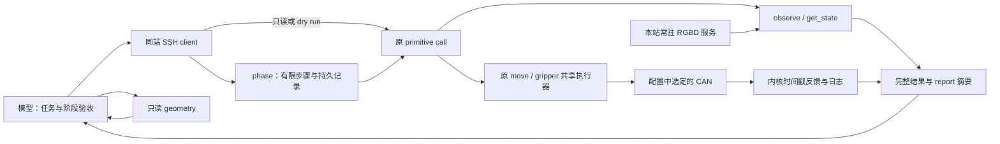

# 控制与观测职责

模型先明确目标服务器，再读取图片、深度与机械臂反馈，选择目标并判断结果；底层工具承担重复的采集、规划、执行和遥测。物体坐标和任务顺序不写入控制器。

共用 skill 和控制实现，通过 [服务器档案](../config/servers.json) 路由到不同 SSH 账户/部署，再读取本站运行配置。只读选择器 [sites.py](../src/agilex_control/sites.py) 接受明确 IP/ID，不连接设备、不默认选站；相机身份、CAN 拓扑、标定和证据按服务器隔离。各站部署和实测范围见 [项目入口](../README.md#服务器入口--2026-09-13)，不能用某站成功推断另一站状态。

`client.py` 负责选定站点的 SSH 传输及一次取回结果中各相机的图像文件；实际单次动作可包成一阶段并附带观察。它不持有 CAN/相机、不设置任务坐标，也不在通信失败后切换服务器或换身份重放动作。

`phase.py` 是原 primitive 的有限顺序组合。输出目录和请求/配置摘要绑定持久身份，动作调用前记录 started；重复调用返回原记录，所有者丢失而没有终态则保留 uncertain。动作、动作后观察和本地文件传输分别报告；观察重试只补观察。阶段与单次动作共用现场动作锁和 stop 协调，不建立另一个运动循环。

相机采集和运动调度分离；观察不创建机器人 SDK 实例、不写 CAN。`trajectory.py` 提供关节与夹爪两类轨迹，`motion.py` 只保留一个有限执行循环。move 写所选臂的 mode/joint 帧；set_gripper 只写所选臂的 0x159 夹爪执行帧。左右工具固定绑定各自设备，共享数学、协议、反馈和停止语义。工具不修改零点、固件或机械臂使能配置；夹爪执行帧自身使用协议要求的使能位。

相机服务名、数量、分辨率和深度对齐来自现场配置；每份观测携带对应内参和时间戳，不保证跨相机硬同步。`report.py` 从原始结果生成实测摘要、可计算的目标误差和证据路径；`task_success` 保持未知，夹持和放置结果由模型据图验收。

`geometry.py` 只读取已有观测和显式参数，完成逐帧反投影、相机/基座变换和任务点到 link6 目标的换算；腕部使用采样时实际关节的 FK，候选标定保留原状态。它不会把缺失 TCP 补成常量，也不代替 IK、当前场景与持物关系验证。共享运动学使用原始旋转矩阵，避免近 pitch ±90° 时有损的 SDK Euler 展示；模型源和验证边界见 [工具契约](primitives.md#初始化与型号几何)。

任务专用的对中、接触和成败判断留在技能参考页，例如 [叠杯任务](../skills/wcx-agilex-control/references/cup-nesting.md)。任务坐标、物体到 link6 的暂定关系及原始请求归 evidence/experiments；发生滑移后上层作废后续目标，不向通用模块增加杯型分支。完整输入、持久记录与重试语义见 [工具契约](primitives.md)，本次离线与实机覆盖分别见 [验证范围](validation.md)。

## 标定数据处理

标定采样仍组合原 observe 和 move；`calibration_board.py` 只读取已落盘图像与逐帧内参，输出 ChArUco/PnP 和深度质检；`calibration_hand_eye.py` 只读取实测末端及板位姿矩阵，求手眼、固定相机到基座的候选变换与训练/留出残差。这两个离线模块不占有相机、不连接 CAN、不自动改控制配置。算法及矩阵契约可复用，物理相机、机器人 FK、板尺寸与安装参数独立保存。命令、采样条件、尺度不确定性和场景变化后的复核见 [标定流程](../skills/wcx-agilex-control/references/calibration.md)。

## 设计候选：按需目标分割（SAM 3，暂缓）

**决策日期：2026-09-13。状态：仅记录设计，暂缓评估与接入，未排期、未实现、未部署。** 是否采用由现场数据验证决定，不作为现有 observe / geometry / move 的必需依赖。

考虑它的原因：现有工具已返回图像和反馈，但模型仍需反复定位同一物体、指定取深度的像素、寻找动作前后的比较区域。[本轮叠杯记录](../evidence/2026-09-13/host-10.169.21.1/cup-nesting-framework-1757/README.md) 提供了复盘数据；这些工作是候选优化点，尚未实测分割能节省多少时间。[SAM 3 官方实现](https://github.com/facebookresearch/sam3) 支持文字、点或框提示的物体分割及视频跟踪，适合作为可替换的感知工具候选。预期用途为：

- 根据任务指定的目标输出像素区域，减少重复找物体和手工圈选，生成同一目标的动作前后局部对比。
- 在目标区域内筛选有效深度、减少背景混入，再复用已有反投影、标定变换与 FK；区域筛选本身不提高标定精度。
- 结合深度和采样时相机位姿提供物体移动的证据，辅助模型判断试提、搬运和释放结果。

拟议接入位置为“已有 observe → 按需分割 → 已有 geometry / report → 模型判断 → 原动作工具”。分割读取已有观测，输出区域、模型评分及对应相机/观测标识；不接管采集、控制、标定或任务规划，不写杯型分支和场景坐标。具体接口等验证有收益后再定，避免先建一套感知框架。前后裁图对比可先由显式选点或区域完成，不依赖 SAM 3。

能力边界：整物体的区域中心不等于接触点或杯口中心，外轮廓不保证对应同一物理杯沿；分割不直接给出可靠三维轴线，也不能证明抓牢或放稳。模型评分不是毫米精度或动作成功概率。相同外观、遮挡、相机移动和稀疏观测下的目标身份必须验证；视频跟踪能力不能直接推定为跨相机或长间隔跟踪可靠。

恢复评估时，先在已有观测上检查相邻同色物体是否分开、夹爪遮挡后是否认错目标、深度取样是否减少背景污染，并在拟部署设备上测量加载及推理耗时。采用标准是减少人工纠正和总判断时间，同时保持任务所需的定位与异常识别质量；不能只凭分割图好看或模型评分高决定接入。叠杯可作首批样本，其他物体与现场需另行验证，结论不得直接泛化。目前未安装模型、未运行上述评估，性能和效果均未知。
